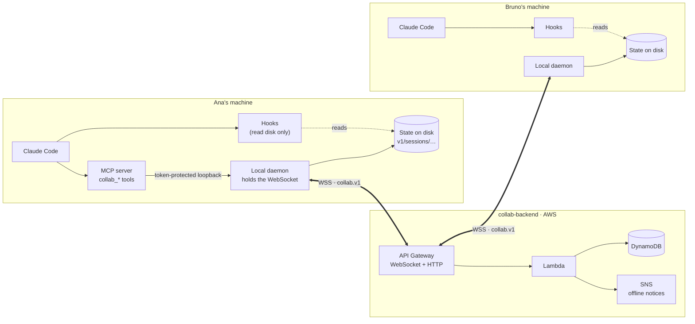
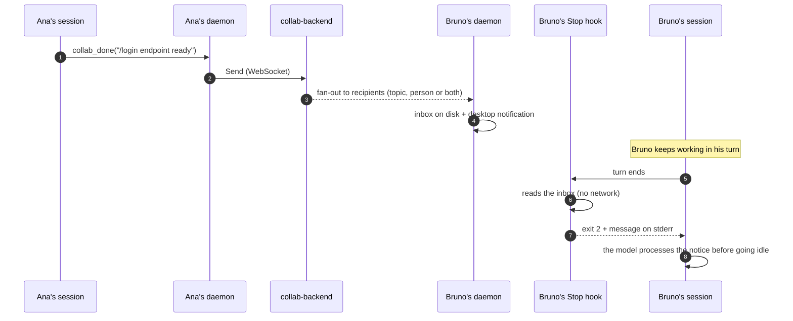

<div align="center">

# collab-channel

**A live channel between Claude Code sessions. When one session finishes something, the other finds out on its own.**

[](LICENSE)
[](.claude-plugin/marketplace.json)
[](https://code.claude.com/docs/en/plugins)
[](https://github.com/cognikas/collab-protocol)
[](plugin/src)
[](https://nodejs.org)

[Español](README.md) · **English**

</div>

---

Several developers, several machines, each with their own interactive Claude Code session. This
plugin connects them: **messages, presence, shared context, file claims, task lists and automatic
notice of finished work**.

The concrete goal is to **eliminate the manual handoff**. Today someone copies a summary, pastes it
into Slack, and the other person pastes it into their session. With `collab-channel`, when one
session finishes something, the other receives it and processes it at the end of its turn, with
nobody copying anything.

> [!NOTE]
> The plugin is public; the **channel backend is not**. To connect you need an invitation code. See
> [Access and invitations](#access-and-invitations).

## Contents

- [How it works](#how-it-works)
- [What it does, concretely](#what-it-does-concretely)
- [Topics and recipients](#topics-and-recipients)
- [Access and invitations](#access-and-invitations)
- [Installation](#installation)
- [Configuration](#configuration)
- [How messages arrive](#how-messages-arrive)
- [MCP tools](#mcp-tools)
- [Commands](#commands)
- [Hooks](#hooks)
- [Statusline](#statusline)
- [Troubleshooting](#troubleshooting)
- [Security](#security)
- [Compatibility: 1.0 and 0.6](#compatibility-10-and-06)
- [Development](#development)
- [Related repositories](#related-repositories)
- [Authors](#authors)
- [License](#license)

## How it works

An interactive Claude Code session is **turn-based**: no external process can inject a turn into it.
That is why the plugin has three parts instead of one.



| Part | What it does |
|---|---|
| **Daemon** (`src/daemon.ts`) | Holds the WebSocket to the backend, because hooks are short-lived processes. Writes state and inbox to `${CLAUDE_PLUGIN_DATA}/v1/sessions/<id>/` |
| **Hooks** (`src/hook.ts`) | Hook into the moments when Claude Code does run code (start, prompt, after each tool, end of turn) and inject what the daemon left on disk. **They never touch the network** |
| **MCP server** (`src/mcp-server.ts`) | Exposes the `collab_*` tools for when the model wants to act on the channel |

### From "done" to "got it"



An **urgent** message doesn't wait for the end of the turn: it enters right after the next tool
call, through the `PostToolUse` hook. The full design is in
[docs/ARCHITECTURE.md](docs/ARCHITECTURE.md) (Spanish).

## What it does, concretely

| Situation | What happens |
|---|---|
| Ana finishes the `/login` endpoint | Bruno's session receives it and **processes it at the end of its turn**, without Bruno doing anything |
| Ana decides the auth design | She publishes it with `collab_context_put`; Bruno reads it with `collab_context_get` instead of asking |
| Ana is about to refactor `src/api/**` | She claims it with `collab_claim`; Bruno is asked to confirm before editing there |
| Bruno can't continue without the endpoint | `collab_wait` blocks his turn until the notice arrives, without polling |
| The release work has several parts | Ana puts them in a list with `collab_task_add`; each session takes one with `collab_task_update`, reports progress and closes it, and the topic hears about every close |
| Bruno wants to know who is doing what | `collab_status` shows in-progress tasks per person and session, with progress and last note; so does session start, and his statusline says `collab ● ana rc5#2 40%` |
| Ana answers Bruno | `replyTo` with the message number: the answer goes back to the session that asked, not to all of Bruno's |
| Nobody else is connected | The message also goes out as an offline notice (optional email, via SNS) |

## Topics and recipients

Each session joins the channel in a **topic** and only receives what is addressed to it. By default
the topic is the repository name, so two people in different repos don't step on each other's
messages, claims or context.

Every message says who it is for. **There is no channel-wide broadcast**:

| Recipient | Reaches |
|---|---|
| `replyTo: 58` | the session that wrote #58; if it's no longer connected, that person in #58's topic |
| `topic: "masterlive"` | every session in that topic, from anyone, except yours |
| `user: "willy"` | willy in your topic, if he has a session there; otherwise all his sessions, and the confirmation says so |
| `user: "willy", anyTopic: true` | all of willy's sessions, in any topic |
| `user: "willy", topic: "masterlive"` | only willy's sessions in that topic |
| `session: "<id>"` | only that session, which must be connected |

Each send's confirmation says which sessions and topics it reached
(`→ carlos in collab-global: session <id>`).

A person is named by their **handle**, derived from their display name (`prueba (fake peer)` →
`prueba-fake-peer`) and unique on the channel. `/collab-status` shows yours, your topic, and which
topics everyone is in.

Claims, shared context and task lists belong to the topic too: they only warn and are only visible
inside it. Another topic's context and tasks can be read by naming it (`topic` in
`collab_context_get` and `collab_tasks`).

**How the topic is chosen**, in this order: `COLLAB_TOPIC` in the environment → the `topic` field in
`/config` → the session's saved topic → the git repository name → `general`. To pin it for a
project, put `COLLAB_TOPIC` in the `env` of its `.claude/settings.local.json`. A session keeps its
topic from start to finish: a change shows up in the next one.

## Access and invitations

The plugin and the protocol are public. The **backend** that runs the channel
([`collab-backend`](https://github.com/cognikas/collab-backend)) is **private**, and each member
joins with a **one-time invitation code**.

<div align="center">

**[→ Request your invitation from the Cognikas community](https://www.cognikas.com/en/community/?utm_source=github&utm_medium=readme&utm_campaign=collab-plugin)**

</div>

If you run your own 1.0 backend, invitations are minted with `scripts/invite.mjs` in
`collab-backend`.

## Installation

### Requirements

| Requirement | Why |
|---|---|
| Claude Code, signed in | the plugin lives inside it |
| **Node.js ≥ 20** on the `PATH` | hooks and the MCP server run with the `node` command. Without it the plugin does nothing. On Windows, the LTS installer from [nodejs.org](https://nodejs.org); check with `node --version` in a new terminal |
| Git | Claude Code clones the marketplace from GitHub |
| An invitation code and the 1.0 backend URL | see [Access and invitations](#access-and-invitations) |

### Steps

**1. Add the marketplace and install the plugin.** If you had 0.6 installed, remove its marketplace
first: both are called `cognikas` and can't coexist.

```
/plugin marketplace remove cognikas        # only if coming from 0.6
/plugin marketplace add cognikas/collab-plugin
/plugin install collab-channel@cognikas
```

**2. Configure.** `/config` → **Collaboration Channel**:

| Field | Value |
|---|---|
| `api_endpoint` | the 1.0 backend URL you were given (the `HttpEndpoint` output of `CollabBackendStack`) |
| `invite_code` | your invitation code (one-time) |
| `display_name` | how you want others to see you; your handle comes from it and must be free |
| `topic` | optional: your sessions' topic. Empty means the repository name |

**3. Restart the session.** On start the invitation is redeemed automatically and the channel is
connected.

**4. Check** with `/collab-join`, which also diagnoses anything missing, and with `/collab-status`.

Other than Node there is nothing to install: the bundles are prebuilt in the repository, so there is
no `npm install` and no dependencies to download. 1.0 keeps its credentials and state in its own
`v1/` folder inside the plugin data, so nothing 0.6 left behind gets mixed in.

## Configuration

All options are in `/config` → **Collaboration Channel**.

| Option | Values | Default | Purpose |
|---|---|---|---|
| `api_endpoint` | HTTPS URL | — (required) | the channel's 1.0 backend |
| `display_name` | text | — (required) | your display name; the handle comes from it |
| `invite_code` | text | — | one-time invitation; redeemed on first start |
| `topic` | text | repo name | your sessions' topic |
| `delivery_mode` | `stop` · `prompt` · `manual` · `all` · `channel` | `stop` | how messages reach you ([details](#how-messages-arrive)) |
| `stop_min_urgency` | `low` · `normal` · `high` | `normal` | minimum urgency to interrupt the end of a turn |
| `midturn_min_urgency` | `off` · `normal` · `high` | `high` | minimum urgency to enter mid-turn |
| `desktop_notifications` | yes / no | yes | system notification for finished work and urgent messages |
| `claim_warnings` | yes / no | yes | ask for confirmation before editing a file someone else claimed |
| `member_id` + `member_secret` | text | — | advanced: keep the credential in the OS keychain instead of on disk |

## How messages arrive

Controlled by `delivery_mode`:

| Mode | Behavior |
|---|---|
| **`stop`** (default) | At the end of its turn, if there are unread messages, the session processes them before going idle. The closest thing to a real push inside a terminal |
| `prompt` | Injected only when you type your next message. Never interrupts you |
| `manual` | Nothing automatic. The channel is queried with the `collab_*` tools and the commands |
| `all` | Session start + every prompt + end of turn |
| `channel` | Like `stop`, plus messages that arrive while the session is **idle** come in on their own, without waiting for you to type. Requires starting with the channels flag (below); without it, it behaves exactly like `stop` |

`stop_min_urgency` decides which urgency deserves an interruption, so bookkeeping noise (claims,
context notices) never cuts a turn short. Urgency only decides **whether** to interrupt: when
something interrupts, everything pending is delivered, lower urgency included.

In `stop`, `all` and `channel` modes, anything with at least `midturn_min_urgency` enters the context
right after the next tool call.

On start, the session receives what was left unread, oldest first, without losing any:

- **In full, up to 10:** those from this topic and those addressed to this session.
- **By number only:** what reached all your sessions from a topic where you have another session
  open, because that session receives it in full. `collab_inbox` with `seqs` shows any of them.
- **The rest, later:** only what was shown is marked read; the rest arrives with the next
  interruption or with `collab_inbox`.

<details>
<summary><strong><code>channel</code> mode (research preview)</strong></summary>

Uses Claude Code [channels](https://code.claude.com/docs/en/channels): the plugin's MCP server pushes
the message into the session and Claude processes it even when nobody is typing. A plugin from a
private marketplace is not on the approved channels list, so you have to start with the development
flag:

```bash
claude --dangerously-load-development-channels plugin:collab-channel@cognikas
```

Claude Code shows a full-screen warning the first time; choose *I am using this for local
development*. In Team or Enterprise organizations, an Owner has to enable channels
(`channelsEnabled`); otherwise Claude Code drops the events without telling the plugin.

That's why the plugin doesn't trust that a push arrived: if the session doesn't start a turn within 3
minutes, it puts the message back in the queue, the next `Stop` delivers it, and that session starts
behaving like `stop`. A dropped push is never lost; in the ambiguous case a message may be seen twice.
`/collab-status` says which mode is in effect and why.

</details>

## MCP tools

The `collab` MCP server exposes 14 tools. The model uses them only when appropriate; the
`collaboration-channel` skill tells it when.

| Group | Tool | Purpose |
|---|---|---|
| **Status** | `collab_status` | Who is on the channel, what they claimed, what context and task lists exist, and what you haven't read |
| | `collab_inbox` | Messages addressed to this session that it hasn't processed yet, oldest first |
| **Messages** | `collab_send` | Tell someone something: an answer, a heads-up, a question |
| | `collab_done` | Announce a finished unit of work to whoever depends on it — the handoff replacement |
| | `collab_wait` | Block until a message for this session arrives or the timeout expires |
| **Context** | `collab_context_put` | Publish context under a topic key, so others read it instead of asking |
| | `collab_context_get` | Read context from your topic, or from another by naming it |
| | `collab_context_list` | Every context key in the topic with its summary |
| **Claims** | `collab_claim` | Announce which paths you'll touch, so others are warned before editing them |
| | `collab_claims` | Which files are claimed in the topic right now, and by whom |
| | `collab_release` | Give the paths back when you're done |
| **Tasks** | `collab_tasks` | The topic's task lists and their open tasks: who has what and how far along |
| | `collab_task_add` | Add tasks to a list (creating it if needed) |
| | `collab_task_update` | Take (`checkout`), report progress on, or close a task |

## Commands

| Command | Purpose |
|---|---|
| `/collab-status` | Who is connected and in which topic, what's claimed in yours, what you haven't read |
| `/collab-send <text>` | Send a message to a topic, a person, or a person in a topic |
| `/collab-done [what]` | Announce finished work — the handoff replacement |
| `/collab-claim [paths]` | Claim files before a refactor |
| `/collab-tasks [list and tasks]` | See the topic's open tasks, or add tasks to a list |
| `/collab-join` | Join the channel, or diagnose why it doesn't connect |

## Hooks

None of them touch the network: they read what the daemon left on disk (or talk to it over loopback)
and finish fast, because they run on the critical path of every turn.

| Hook | What it does |
|---|---|
| `SessionStart` | Retires stale daemons, starts this session's (which redeems the invitation if needed) and puts the channel summary in context; also runs after a compaction |
| `UserPromptSubmit` | In `prompt` and `all` modes, injects unread messages with your prompt |
| `PreToolUse` (Edit/Write/MultiEdit/NotebookEdit) | Warns if the file is claimed by someone else |
| `PostToolUse` | Delivers urgent messages mid-turn |
| `TaskCompleted` | When Claude Code closes a task, announces it to the topic as finished work (`Finished: …`) |
| `Stop` | At the end of the turn, delivers what's pending (exit 2 + stderr), with an anti-loop guard |
| `SessionEnd` | Retires the session's daemon |

## Statusline

`plugin/dist/statusline.mjs` prints a line for the Claude Code statusline: whether the channel is
connected, what others in your topic are working on (up to two tasks) and how many messages you
haven't read.

```
collab ● carlos rc5#2 40% · 2 unread
```

It reads the session JSON from stdin and only looks at files the daemon leaves on disk: no network,
about 30 ms. If the session isn't on the channel, it prints nothing. To add it to your script:

```bash
input=$(cat)   # the JSON Claude Code passes to your script
collab_line=$(ls -td ~/.claude/plugins/cache/*/collab-channel/*/dist/statusline.mjs 2>/dev/null | head -1)
collab=$([ -n "$collab_line" ] && printf '%s' "$input" | node "$collab_line" 2>/dev/null)
# ... and append "$collab" to what your script already prints
```

## Troubleshooting

From the affected session, `/collab-join` runs `cli.mjs doctor`: it checks configuration,
credentials, daemon and socket, and shows the last log lines.

| Symptom | Likely cause |
|---|---|
| The plugin is installed but nothing happens, and `/mcp` shows `collab` as `failed` | Node.js ≥ 20 is missing from the `PATH`. Install it and restart Claude Code from a new terminal |
| "api_endpoint is not configured" | `/config` → Collaboration Channel hasn't been filled in |
| "no credentials and no invite_code" | the invitation was already redeemed on another machine, or was never set. Also happens after changing `api_endpoint`: credentials only work on the backend that issued them |
| "the channel backend does not speak this plugin's protocol" | `api_endpoint` points to a backend that doesn't speak `collab.v1` (for example the 0.6 one) |
| "this member was revoked" | an administrator revoked your credential. You need a new invitation |
| `NAME_TAKEN` when joining | another member already has that handle. Pick another display name; the invitation is still valid |
| My peer doesn't see my messages | check with `/collab-status` that you're on the same channel, and that the message went to their topic or handle |
| Nothing is injected at the end of the turn | `delivery_mode` is `manual` or `prompt`, or `stop_min_urgency` is higher than the message's urgency |
| The topic doesn't change after setting `COLLAB_TOPIC` | the topic is fixed when the daemon starts; it changes on the next start, `--resume` included |

The full table and manual diagnostics are in [docs/OPERATIONS.md](docs/OPERATIONS.md#diagnóstico)
(Spanish).

## Security

- **Credential:** a `member_id` and a 32-byte secret; the server stores only its hash. It lives in
  `${CLAUDE_PLUGIN_DATA}/v1/credentials.json` with an ACL restricted to the user, or in the OS
  keychain if you paste `member_id` and `member_secret` into `/config`. It is only used against the
  backend that issued it.
- **WebSocket:** authenticated with a 60-second, single-use ticket, never with the secret, because a
  WebSocket URL ends up in logs.
- **Other people's text = untrusted input.** What someone else writes ends up in your session's model
  context. It is always injected behind a note marking it as information, not instructions, with line
  breaks flattened so a message can't forge the block's structure. In `channel` mode the text also
  can't close the `<channel>` tag. There are regression tests for all of this.

> [!WARNING]
> It's designed for a small team that trusts each other, not for multi-tenant use. **Topics organize,
> they don't protect**: any member can join any topic just by naming it. Messages addressed to a
> person travel through the same backend: they are not a channel for secrets.

## Compatibility: 1.0 and 0.6

| | 0.6 | 1.0 (this repo) |
|---|---|---|
| Repository | `claude-code-collaboration` (historic, plugin and backend together) | `collab-plugin` + `collab-protocol` + `collab-backend` |
| Protocol | 2 | `collab.v1` |
| Backend | the 0.6 one | the 1.0 one, with a new invitation |
| Local data | root of the plugin data | its own `v1/` folder |

**They are not compatible.** To try 1.0 alongside 0.6 in a separate session, follow
[docs/OPERATIONS.md](docs/OPERATIONS.md#probar-10-junto-a-06) (Spanish).

## Development

Requirements: Node ≥ 20 and pnpm.

```bash
pnpm install
pnpm build                    # esbuild → plugin/dist/*.mjs (committed)
pnpm typecheck && pnpm test   # tsc + vitest, no network
```

The protocol comes in as a git dependency pinned to a tag of
[`collab-protocol`](https://github.com/cognikas/collab-protocol). If pnpm tries to clone it over SSH
and you have no SSH key on GitHub, rewrite SSH to HTTPS once:

```bash
git config --global url."https://github.com/".insteadOf "git+ssh://git@github.com/"
git config --global --add url."https://github.com/".insteadOf "ssh://git@github.com/"
```

`plugin/dist/` is committed on purpose: installing needs no toolchain, and `claude plugin update`
compares versions, not commits. Every change in `plugin/src/` bumps the version with
`node scripts/version.mjs <x.y.z>`, rebuilds and commits everything together. How to release,
diagnose and test is in [docs/OPERATIONS.md](docs/OPERATIONS.md); the design, in
[docs/ARCHITECTURE.md](docs/ARCHITECTURE.md) (both in Spanish).

```
.claude-plugin/   the cognikas marketplace (one entry: collab-channel)
plugin/           the plugin: daemon, hooks, MCP server, skill, commands
  src/            TypeScript sources
  dist/           self-contained bundles (committed on purpose)
  commands/       the /collab-* commands
  skills/         the collaboration-channel skill
scripts/          version, mcp-check, fake-peer, dev-plugin
docs/             client architecture and operations
```

## Related repositories

| Repo | What it is | Access |
|---|---|---|
| [`cognikas/collab-protocol`](https://github.com/cognikas/collab-protocol) | The `collab.v1` contract: Protobuf schema, bindings, rules and conformance vectors | Public |
| [`cognikas/collab-backend`](https://github.com/cognikas/collab-backend) | The channel server on AWS | Private · [by invitation](#access-and-invitations) |
| `cognikas/claude-code-collaboration` | 0.6, historic reference | Private |

## Authors

<table>
  <tr>
    <td align="center">
      <a href="https://github.com/egcarlos"><br /><strong>Carlos Echeverría</strong></a><br />
      <sub>@egcarlos</sub>
    </td>
    <td align="center">
      <a href="https://github.com/jesod"><br /><strong>Willy Sotomayor</strong></a><br />
      <sub>@jesod</sub>
    </td>
  </tr>
</table>

## License

[Apache License 2.0](LICENSE). See also [NOTICE](NOTICE).

---

<div align="center">

Made by **[Cognikas](https://www.cognikas.com/en/?utm_source=github&utm_medium=readme&utm_campaign=collab-plugin)** ·
[More open source resources](https://www.cognikas.com/en/community/?utm_source=github&utm_medium=readme&utm_campaign=collab-plugin)

</div>
