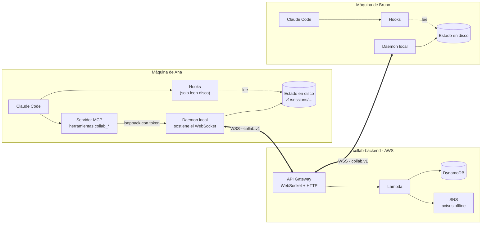
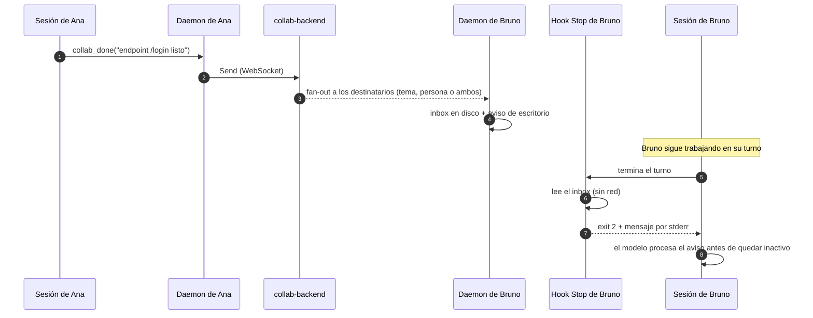

<div align="center">

# collab-channel

**Un canal en vivo entre sesiones de Claude Code. Cuando una sesión termina algo, la otra se entera sola.**

[](LICENSE)
[](.claude-plugin/marketplace.json)
[](https://code.claude.com/docs/en/plugins)
[](https://github.com/cognikas/collab-protocol)
[](plugin/src)
[](https://nodejs.org)

**Español** · [English](README.en.md)

</div>

---

Varios programadores, varias máquinas, cada uno con su sesión interactiva de Claude Code. Este
plugin las conecta: **mensajes, presencia, contexto compartido, reserva de archivos, listas de tareas
y aviso automático de trabajo terminado**.

El objetivo concreto es **eliminar el handoff manual**. Hoy uno copia un resumen, lo pega en Slack, y
el otro lo pega en su sesión. Con `collab-channel`, cuando una sesión termina algo, la otra lo recibe
y lo procesa al cerrar su turno, sin que nadie copie nada.

> [!NOTE]
> El plugin es público; el **backend del canal no**. Para conectarte necesitas un código de
> invitación. Mira [Acceso e invitaciones](#acceso-e-invitaciones).

## Contenido

- [Cómo funciona](#cómo-funciona)
- [Qué hace, en concreto](#qué-hace-en-concreto)
- [Temas y destinatarios](#temas-y-destinatarios)
- [Acceso e invitaciones](#acceso-e-invitaciones)
- [Instalación](#instalación)
- [Configuración](#configuración)
- [Cómo llegan los mensajes](#cómo-llegan-los-mensajes)
- [Herramientas MCP](#herramientas-mcp)
- [Comandos](#comandos)
- [Hooks](#hooks)
- [Statusline](#statusline)
- [Solución de problemas](#solución-de-problemas)
- [Seguridad](#seguridad)
- [Compatibilidad: 1.0 y 0.6](#compatibilidad-10-y-06)
- [Desarrollo](#desarrollo)
- [Repositorios relacionados](#repositorios-relacionados)
- [Autores](#autores)
- [Licencia](#licencia)

## Cómo funciona

Una sesión interactiva de Claude Code es **por turnos**: ningún proceso externo puede inyectarle un
turno. Por eso el plugin tiene tres piezas y no una.



| Pieza | Qué hace |
|---|---|
| **Daemon** (`src/daemon.ts`) | Sostiene el WebSocket con el backend, porque los hooks son procesos efímeros. Escribe el estado y el inbox en `${CLAUDE_PLUGIN_DATA}/v1/sessions/<id>/` |
| **Hooks** (`src/hook.ts`) | Se enganchan a los momentos en que Claude Code sí ejecuta código (arranque, prompt, tras cada herramienta, fin de turno) e inyectan lo que el daemon dejó en disco. **Nunca tocan la red** |
| **Servidor MCP** (`src/mcp-server.ts`) | Expone las herramientas `collab_*` para cuando el modelo quiere actuar sobre el canal |

### Del «terminé» al «me enteré»



Un mensaje **urgente** no espera al fin del turno: entra justo después de la siguiente llamada a
herramienta, por el hook `PostToolUse`. El diseño completo está en
[docs/ARCHITECTURE.md](docs/ARCHITECTURE.md).

## Qué hace, en concreto

| Situación | Qué pasa |
|---|---|
| Ana termina el endpoint `/login` | La sesión de Bruno lo recibe y **lo procesa al cerrar su turno**, sin que Bruno haga nada |
| Ana decide el diseño de auth | Lo publica con `collab_context_put`; Bruno lo lee con `collab_context_get` en vez de pedírselo |
| Ana va a refactorizar `src/api/**` | Lo reserva con `collab_claim`; a Bruno se le pide confirmación antes de editar ahí |
| Bruno no puede seguir sin el endpoint | `collab_wait` bloquea su turno hasta que llegue el aviso, sin polling |
| El trabajo del release tiene varias partes | Ana las pone en una lista con `collab_task_add`; cada sesión toma una con `collab_task_update`, reporta avance y la cierra, y el tema se entera de cada cierre |
| Bruno quiere saber en qué anda cada uno | `collab_status` muestra las tareas en curso por persona y sesión, con avance y última nota; el arranque de sesión también, y su statusline dice `collab ● ana rc5#2 40%` |
| Ana le contesta a Bruno | `replyTo` con el número del mensaje: la respuesta vuelve a la sesión que preguntó, no a todas las de Bruno |
| Nadie más está conectado | El mensaje sale también como aviso offline (email opcional, vía SNS) |

## Temas y destinatarios

Cada sesión entra al canal en un **tema** y solo recibe lo que va dirigido a ella. Por defecto el
tema es el nombre del repositorio, así que dos personas en repos distintos no se pisan los mensajes,
las reservas ni el contexto.

Todo mensaje dice para quién es. **No hay difusión a todo el canal**:

| Destinatario | Llega a |
|---|---|
| `replyTo: 58` | la sesión que escribió el #58; si ya no está conectada, esa persona en el tema del #58 |
| `topic: "masterlive"` | todas las sesiones en ese tema, de cualquier persona, menos las tuyas |
| `user: "willy"` | willy en tu tema, si tiene una sesión ahí; si no, todas sus sesiones, y la confirmación lo dice |
| `user: "willy", anyTopic: true` | todas las sesiones de willy, en cualquier tema |
| `user: "willy", topic: "masterlive"` | solo las sesiones de willy en ese tema |
| `session: "<id>"` | solo esa sesión, que tiene que estar conectada |

La confirmación de cada envío dice a qué sesiones y temas llegó
(`→ carlos in collab-global: session <id>`).

A una persona se la nombra por su **handle**, que sale de su nombre visible (`prueba (fake peer)` →
`prueba-fake-peer`) y es único en el canal. `/collab-status` muestra el tuyo, tu tema, y en qué temas
está cada uno.

Las reservas, el contexto compartido y las listas de tareas también son del tema: solo avisan y se
ven dentro de él. El contexto y las tareas de otro tema se pueden leer nombrándolo (`topic` en
`collab_context_get` y `collab_tasks`).

**Cómo se elige el tema**, en este orden: `COLLAB_TOPIC` en el entorno → el campo `topic` de
`/config` → el tema guardado de la sesión → el nombre del repositorio git → `general`. Para fijarlo
en un proyecto, pon `COLLAB_TOPIC` en el `env` de su `.claude/settings.local.json`. Una sesión
conserva su tema de principio a fin: el cambio se nota en la siguiente.

## Acceso e invitaciones

El plugin y el protocolo son públicos. El **backend** que opera el canal
([`collab-backend`](https://github.com/cognikas/collab-backend)) es **privado** y cada miembro entra
con un **código de invitación de un solo uso**.

<div align="center">

**[→ Pide tu invitación en la comunidad de Cognikas](https://www.cognikas.com/comunidad/?utm_source=github&utm_medium=readme&utm_campaign=collab-plugin)**

</div>

Si administras tu propio backend 1.0, las invitaciones se emiten con `scripts/invite.mjs` de
`collab-backend`.

## Instalación

### Requisitos

| Requisito | Por qué |
|---|---|
| Claude Code con sesión iniciada | el plugin vive dentro de él |
| **Node.js ≥ 20** en el `PATH` | los hooks y el servidor MCP se ejecutan con el comando `node`. Sin él, el plugin no hace nada. En Windows, el instalador LTS de [nodejs.org](https://nodejs.org); comprueba con `node --version` en una terminal nueva |
| Git | Claude Code clona el marketplace desde GitHub |
| Un código de invitación y la URL del backend 1.0 | ver [Acceso e invitaciones](#acceso-e-invitaciones) |

### Pasos

**1. Agrega el marketplace e instala el plugin.** Si tenías la 0.6 instalada, quita antes su
marketplace: los dos se llaman `cognikas` y no pueden estar a la vez.

```
/plugin marketplace remove cognikas        # solo si venías de la 0.6
/plugin marketplace add cognikas/collab-plugin
/plugin install collab-channel@cognikas
```

**2. Configura.** `/config` → **Collaboration Channel**:

| Campo | Valor |
|---|---|
| `api_endpoint` | la URL del backend 1.0 que te pasaron (la salida `HttpEndpoint` de `CollabBackendStack`) |
| `invite_code` | tu código de invitación (de un solo uso) |
| `display_name` | cómo quieres que te vean los demás; de aquí sale tu handle, que tiene que estar libre |
| `topic` | opcional: el tema de tus sesiones. Vacío, el nombre del repositorio |

**3. Reinicia la sesión.** En el arranque se canjea la invitación sola y el canal queda conectado.

**4. Comprueba** con `/collab-join`, que además diagnostica si algo falta, y con `/collab-status`.

Aparte de Node no hace falta instalar nada: los bundles vienen compilados en el repositorio, así que
no hay `npm install` ni dependencias que bajar. La 1.0 guarda sus credenciales y su estado en una
carpeta `v1/` propia dentro de los datos del plugin, así que lo que dejó la 0.6 no se mezcla.

## Configuración

Todas las opciones están en `/config` → **Collaboration Channel**.

| Opción | Valores | Por defecto | Para qué |
|---|---|---|---|
| `api_endpoint` | URL HTTPS | — (obligatoria) | backend 1.0 del canal |
| `display_name` | texto | — (obligatoria) | tu nombre visible; de él sale el handle |
| `invite_code` | texto | — | invitación de un solo uso; se canjea en el primer arranque |
| `topic` | texto | nombre del repo | tema de tus sesiones |
| `delivery_mode` | `stop` · `prompt` · `manual` · `all` · `channel` | `stop` | cómo te llegan los mensajes ([detalle](#cómo-llegan-los-mensajes)) |
| `stop_min_urgency` | `low` · `normal` · `high` | `normal` | urgencia mínima para interrumpir el fin de un turno |
| `midturn_min_urgency` | `off` · `normal` · `high` | `high` | urgencia mínima para entrar a mitad de turno |
| `desktop_notifications` | sí / no | sí | aviso del sistema para trabajo terminado y mensajes urgentes |
| `claim_warnings` | sí / no | sí | pedir confirmación antes de editar un archivo reservado por otro |
| `member_id` + `member_secret` | texto | — | avanzado: guarda la credencial en el llavero del sistema en vez de en disco |

## Cómo llegan los mensajes

Lo controla `delivery_mode`:

| Modo | Comportamiento |
|---|---|
| **`stop`** (por defecto) | Al terminar su turno, si hay mensajes sin leer, la sesión los procesa antes de quedar inactiva. Es lo más parecido a un push real dentro de la terminal |
| `prompt` | Solo se inyectan cuando escribes tu siguiente mensaje. Nunca te interrumpe |
| `manual` | Nada automático. El canal se consulta con las herramientas `collab_*` y los comandos |
| `all` | Arranque de sesión + cada prompt + fin de turno |
| `channel` | Como `stop`, y además los mensajes que llegan con la sesión **inactiva** entran solos, sin esperar a que escribas. Requiere arrancar con el flag de channels (abajo); sin él funciona exactamente como `stop` |

`stop_min_urgency` decide qué urgencia merece interrumpir, así que el ruido de bookkeeping
(reservas, avisos de contexto) nunca corta un turno. La urgencia solo decide **si** se interrumpe:
cuando algo interrumpe, se entrega todo lo pendiente, también lo de menor urgencia.

En los modos `stop`, `all` y `channel`, lo que tenga urgencia al menos `midturn_min_urgency` entra en
el contexto justo después de la siguiente llamada a herramienta.

Al arrancar, la sesión recibe lo que quedó sin leer, del más viejo al más nuevo, sin perder ninguno:

- **Completos, hasta 10:** los de este tema y los dirigidos a esta sesión.
- **Solo por número:** lo que llegó a todas tus sesiones desde un tema donde tienes otra sesión
  abierta, porque esa sesión lo recibe completo. `collab_inbox` con `seqs` muestra cualquiera.
- **El resto, después:** solo se marca como leído lo que se mostró; lo demás llega con la siguiente
  interrupción o con `collab_inbox`.

<details>
<summary><strong>Modo <code>channel</code> (research preview)</strong></summary>

Usa los [channels](https://code.claude.com/docs/en/channels) de Claude Code: el servidor MCP del
plugin empuja el mensaje a la sesión y Claude lo procesa aunque nadie esté escribiendo. Un plugin de
un marketplace propio no está en la lista de channels aprobados, así que hay que arrancar con el flag
de desarrollo:

```bash
claude --dangerously-load-development-channels plugin:collab-channel@cognikas
```

Claude Code muestra un aviso a pantalla completa la primera vez; elige *I am using this for local
development*. En organizaciones Team o Enterprise, un Owner tiene que activar los channels
(`channelsEnabled`); si no, Claude Code descarta los eventos sin avisar al plugin.

Por eso el plugin no se fía de que el push haya llegado: si en 3 minutos la sesión no arranca ningún
turno, devuelve el mensaje a la cola, lo entrega el siguiente `Stop` y esa sesión pasa a comportarse
como `stop`. Un push descartado no se pierde; en el caso dudoso un mensaje puede verse dos veces.
`/collab-status` dice qué modo está en vigor y por qué. Detalles en
[docs/ARCHITECTURE.md](docs/ARCHITECTURE.md#entrega-con-la-sesión-inactiva-modo-channel).

</details>

## Herramientas MCP

El servidor MCP `collab` expone 14 herramientas. El modelo las usa solo cuando corresponde; la skill
`collaboration-channel` le explica cuándo.

| Grupo | Herramienta | Para qué |
|---|---|---|
| **Estado** | `collab_status` | Quién está en el canal, qué reservó, qué contexto y listas de tareas hay, y qué no has leído |
| | `collab_inbox` | Mensajes dirigidos a esta sesión que aún no procesó, del más viejo al más nuevo |
| **Mensajes** | `collab_send` | Decirle algo a alguien: una respuesta, un aviso, una pregunta |
| | `collab_done` | Anunciar una unidad de trabajo terminada a quien depende de ella — el reemplazo del handoff |
| | `collab_wait` | Bloquear hasta que llegue un mensaje para esta sesión o venza el timeout |
| **Contexto** | `collab_context_put` | Publicar un contexto bajo una clave del tema, para que los demás lo lean en vez de preguntar |
| | `collab_context_get` | Leer contexto del tema, o de otro tema nombrándolo |
| | `collab_context_list` | Todas las claves de contexto del tema con su resumen |
| **Reservas** | `collab_claim` | Anunciar qué rutas vas a tocar, para que a los demás se les avise antes de editarlas |
| | `collab_claims` | Qué archivos están reservados ahora en el tema, y por quién |
| | `collab_release` | Devolver las rutas al terminar |
| **Tareas** | `collab_tasks` | Las listas de tareas del tema y sus tareas abiertas: quién tiene qué y cuánto avanzó |
| | `collab_task_add` | Agregar tareas a una lista (la crea si no existe) |
| | `collab_task_update` | Tomar (`checkout`), reportar avance o cerrar una tarea |

## Comandos

| Comando | Para qué |
|---|---|
| `/collab-status` | Quién está conectado y en qué tema, qué se reservó en el tuyo, qué no has leído |
| `/collab-send <texto>` | Mandar un mensaje a un tema, a una persona, o a una persona en un tema |
| `/collab-done [qué]` | Anunciar trabajo terminado — el reemplazo del handoff |
| `/collab-claim [rutas]` | Reservar archivos antes de un refactor |
| `/collab-tasks [lista y tareas]` | Ver las tareas abiertas del tema, o agregar tareas a una lista |
| `/collab-join` | Unirse al canal, o diagnosticar por qué no conecta |

## Hooks

Ninguno toca la red: leen lo que el daemon dejó en disco (o le hablan por loopback) y terminan
rápido, porque corren en la ruta crítica de cada turno.

| Hook | Qué hace |
|---|---|
| `SessionStart` | Retira daemons viejos, arranca el de la sesión (que canjea la invitación si hace falta) y pone el resumen del canal en el contexto; también corre tras una compactación |
| `UserPromptSubmit` | En los modos `prompt` y `all`, inyecta lo no leído con tu mensaje |
| `PreToolUse` (Edit/Write/MultiEdit/NotebookEdit) | Avisa si el archivo está reservado por otra persona |
| `PostToolUse` | Entrega a mitad de turno los mensajes urgentes |
| `TaskCompleted` | Cuando Claude Code cierra una tarea, lo anuncia al tema como trabajo terminado (`Finished: …`) |
| `Stop` | Al fin del turno, entrega lo pendiente (exit 2 + stderr), con guard anti-bucle |
| `SessionEnd` | Retira el daemon de la sesión |

## Statusline

`plugin/dist/statusline.mjs` imprime una línea para la statusline de Claude Code: si el canal está
conectado, qué tienen en curso los demás en tu tema (hasta dos tareas) y cuántos mensajes no leíste.

```
collab ● carlos rc5#2 40% · 2 unread
```

Lee el JSON de la sesión por stdin y solo mira los archivos que el daemon deja en disco: no va a la
red y tarda unos 30 ms. Si la sesión no está en el canal, no imprime nada. Para sumarla a tu script:

```bash
input=$(cat)   # el JSON que Claude Code le pasa a tu script
collab_line=$(ls -td ~/.claude/plugins/cache/*/collab-channel/*/dist/statusline.mjs 2>/dev/null | head -1)
collab=$([ -n "$collab_line" ] && printf '%s' "$input" | node "$collab_line" 2>/dev/null)
# ... y agrega "$collab" a lo que tu script ya imprime
```

## Solución de problemas

Desde la sesión afectada, `/collab-join` ejecuta `cli.mjs doctor`: revisa configuración,
credenciales, daemon y socket, y muestra las últimas líneas del log.

| Síntoma | Causa probable |
|---|---|
| El plugin está instalado pero no pasa nada, y `/mcp` muestra `collab` como `failed` | falta Node.js ≥ 20 en el `PATH`. Instálalo y reinicia Claude Code desde una terminal nueva |
| «api_endpoint is not configured» | falta rellenar `/config` → Collaboration Channel |
| «no credentials and no invite_code» | la invitación ya se canjeó en otra máquina, o nunca se puso. También pasa al cambiar `api_endpoint`: las credenciales solo valen en el backend que las emitió |
| «the channel backend does not speak this plugin's protocol» | `api_endpoint` apunta a un backend que no habla `collab.v1` (por ejemplo el de 0.6) |
| «this member was revoked» | un administrador revocó tu credencial. Hace falta una invitación nueva |
| `NAME_TAKEN` al unirse | otro miembro ya tiene ese handle. Elige otro nombre visible; la invitación sigue valiendo |
| El peer no ve mis mensajes | comprueba con `/collab-status` que están en el mismo canal, y que el mensaje fue a su tema o a su handle |
| Nada se inyecta al terminar el turno | `delivery_mode` está en `manual` o `prompt`, o `stop_min_urgency` es más alta que la urgencia del mensaje |
| El tema no cambia después de poner `COLLAB_TOPIC` | el tema se fija cuando arranca el daemon; cambia en el próximo arranque, `--resume` incluido |

La tabla completa y el diagnóstico a mano están en [docs/OPERATIONS.md](docs/OPERATIONS.md#diagnóstico).

## Seguridad

- **Credencial:** un `member_id` y un secreto de 32 bytes; el servidor guarda solo su hash. Vive en
  `${CLAUDE_PLUGIN_DATA}/v1/credentials.json` con la ACL restringida al usuario, o en el llavero del
  sistema si pegas `member_id` y `member_secret` en `/config`. Solo se usa contra el backend que la
  emitió.
- **WebSocket:** se autentica con un ticket de 60 s y de un solo uso, nunca con el secreto, porque la
  URL de un WebSocket acaba en los logs.
- **Texto de otros = entrada no confiable.** Lo que escribe otra persona acaba en el contexto del
  modelo de tu sesión. Se inyecta siempre precedido de una nota que lo marca como información, no
  como instrucciones, y con los saltos de línea aplanados para que un mensaje no pueda falsificar la
  estructura del bloque. En modo `channel`, además, el texto no puede cerrar la etiqueta `<channel>`.
  Hay pruebas de regresión para todo esto.

> [!WARNING]
> Está pensado para un equipo pequeño que confía entre sí, no para multi-tenant. **Los temas
> ordenan, no protegen**: cualquier miembro entra en cualquier tema con solo nombrarlo. Los mensajes
> dirigidos a una persona viajan por el mismo backend: no son un canal para secretos.

## Compatibilidad: 1.0 y 0.6

| | 0.6 | 1.0 (este repo) |
|---|---|---|
| Repositorio | `claude-code-collaboration` (histórico, plugin y backend juntos) | `collab-plugin` + `collab-protocol` + `collab-backend` |
| Protocolo | 2 | `collab.v1` |
| Backend | el de 0.6 | el 1.0, con invitación nueva |
| Datos locales | raíz de los datos del plugin | carpeta `v1/` propia |

**No son compatibles.** Para probar la 1.0 junto a la 0.6 en una sesión aparte, sigue
[docs/OPERATIONS.md](docs/OPERATIONS.md#probar-10-junto-a-06).

## Desarrollo

Requisitos: Node ≥ 20 y pnpm.

```bash
pnpm install
pnpm build                    # esbuild → plugin/dist/*.mjs (commiteado)
pnpm typecheck && pnpm test   # tsc + vitest, sin red
```

El protocolo entra como dependencia git fijada a un tag de
[`collab-protocol`](https://github.com/cognikas/collab-protocol). Si pnpm intenta clonarlo por SSH y
no tienes clave SSH en GitHub, redirige SSH a HTTPS una vez:

```bash
git config --global url."https://github.com/".insteadOf "git+ssh://git@github.com/"
git config --global --add url."https://github.com/".insteadOf "ssh://git@github.com/"
```

`plugin/dist/` se commitea a propósito: instalar no necesita toolchain, y `claude plugin update`
compara versiones, no commits. Cada cambio en `plugin/src/` sube la versión con
`node scripts/version.mjs <x.y.z>`, reconstruye y commitea todo junto. Cómo publicar, diagnosticar y
probar está en [docs/OPERATIONS.md](docs/OPERATIONS.md); el diseño, en
[docs/ARCHITECTURE.md](docs/ARCHITECTURE.md).

```
.claude-plugin/   el marketplace cognikas (una entrada: collab-channel)
plugin/           el plugin: daemon, hooks, servidor MCP, skill, comandos
  src/            fuentes TypeScript
  dist/           bundles autocontenidos (commiteados a propósito)
  commands/       los comandos /collab-*
  skills/         la skill collaboration-channel
scripts/          version, mcp-check, fake-peer, dev-plugin
docs/             arquitectura y operación del cliente
```

## Repositorios relacionados

| Repo | Qué es | Acceso |
|---|---|---|
| [`cognikas/collab-protocol`](https://github.com/cognikas/collab-protocol) | El contrato `collab.v1`: esquema Protobuf, bindings, reglas y vectores de conformidad | Público |
| [`cognikas/collab-backend`](https://github.com/cognikas/collab-backend) | El servidor del canal en AWS | Privado · [por invitación](#acceso-e-invitaciones) |
| `cognikas/claude-code-collaboration` | La 0.6, referencia histórica | Privado |

## Autores

<table>
  <tr>
    <td align="center">
      <a href="https://github.com/egcarlos"><br /><strong>Carlos Echeverría</strong></a><br />
      <sub>@egcarlos</sub>
    </td>
    <td align="center">
      <a href="https://github.com/jesod"><br /><strong>Willy Sotomayor</strong></a><br />
      <sub>@jesod</sub>
    </td>
  </tr>
</table>

## Licencia

[Apache License 2.0](LICENSE). Ver también [NOTICE](NOTICE).

---

<div align="center">

Hecho por **[Cognikas](https://www.cognikas.com/?utm_source=github&utm_medium=readme&utm_campaign=collab-plugin)** ·
[Más recursos open source](https://www.cognikas.com/comunidad/?utm_source=github&utm_medium=readme&utm_campaign=collab-plugin)

</div>
